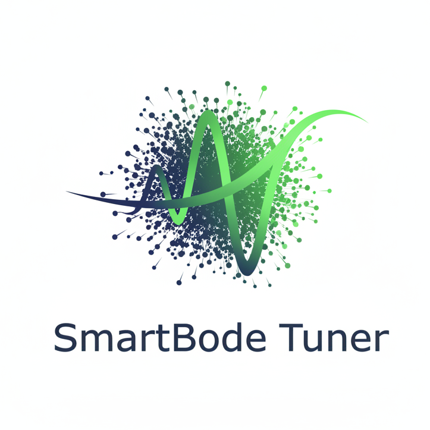

# SmartBode Tuner 🎛️


**Automated Synthesis of LTI Control Systems using Evolutionary Algorithms.**

SmartBode Tuner is a professional web-based CAD platform designed to automate the synthesis of Lead/Lag compensators. It utilizes **Differential Evolution** algorithms to optimize control parameters ($K, T, \alpha$) based on frequency domain requirements (Bode/Nyquist stability margins).

---

## 🏗️ System Architecture

The project follows a modern **Microservices-based Architecture** organized in a Monorepo:

### 1. Frontend Dashboard (Client)
*   **Path:** `/frontend-ui`
*   **Tech:** React, TypeScript, Vite.
*   **Role:** Provides an interactive Single Page Application (SPA) for real-time tuning.
*   **Key Libraries:** `plotly.js` (Logarithmic Bode Plots), `Material UI` (Design System), `Axios`.

### 2. Backend Orchestrator (Gateway)
*   **Path:** `/backend-api`
*   **Tech:** Node.js, Express, MongoDB.
*   **Role:** Acts as an API Gateway, handles user sessions, and manages project persistence.
*   **Function:** Bridges the communication between the React Client and the Python AI Engine.

### 3. AI Computational Engine (Core)
*   **Path:** `/ai-engine`
*   **Tech:** Python 3.10+, FastAPI, NumPy, SciPy.
*   **Role:** The mathematical core. It performs the heuristic optimization using the `differential_evolution` algorithm from SciPy and system analysis via the `python-control` library.

---

## 📂 Project Structure

```text
SmartBodeTuner/
├── ai-engine/             # Python Microservice (Optimization Logic)
├── backend-api/           # Node.js API Gateway (Data Management)
├── frontend-ui/           # React + TypeScript SPA (Visualization)
├── docs/                  # Documentation and diagrams
└── README.md              # Project entry point
```

---

## 🚀 Getting Started

### Prerequisites
*   **Node.js** (v18 or higher)
*   **Python** (v3.9 or higher)
*   **Git**

### Installation Guide

Follow these steps to run the entire stack locally.

#### 1. Setup AI Engine (Python)
```bash
cd ai-engine
# Create virtual environment
python -m venv venv

# Activate virtual environment
# Windows:
venv\Scripts\activate
# Mac/Linux:
source venv/bin/activate

# Install dependencies
pip install -r requirements.txt

# Start the Microservice (Logic)
uvicorn main:app --reload --port 8000
```

#### 2. Setup Backend (Node.js)
```bash
cd backend-api
npm install
# Start the Gateway
npm start
# (Runs on port 3000 by default)
```

#### 3. Setup Frontend (React + TypeScript)
```bash
cd frontend-ui
npm install

# Start the Development Server
npm run dev
# (Accessible at http://localhost:5173)
```

---

## 🧪 Testing Strategy

The project adopts a rigorous testing methodology suitable for critical engineering software:

*   **Unit Testing:** `Vitest` + `React Testing Library` for component logic and isolation.
*   **E2E Testing:** `Cypress` for full optimization flow validation.
*   **Static Analysis:** `TypeScript` (Strict Mode) to ensure type safety for physical quantities.

## ✨ Key Features

*   **Automatic Tuning:** Finds optimal $K, T, \alpha$ for Lead/Lag networks in seconds.
*   **Interactive Plots:** Zoomable, log-scale Bode and Nyquist diagrams.
*   **Constraint Handling:** Automatically rejects unstable closed-loop solutions.
*   **Project History:** Save and compare different tuning versions (stored in MongoDB).

## 👤 Author

**MATTIA FRANCHINI** & **MICHELE BISIGNANO**
